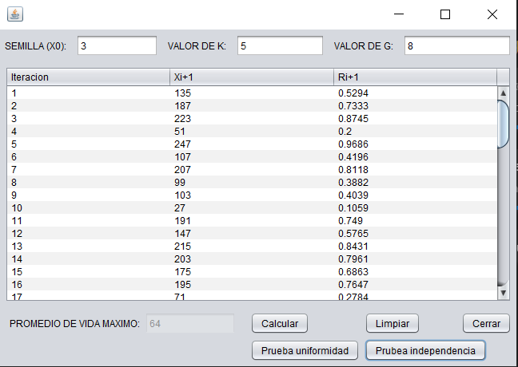

# Pseudo-random number generator

Random pseudonumber generator with graphic interface.

## Multiplicative congruential algorithm

It arises from a Linear Sequential Algorithm , when $C$ = 0;

Then the equation is:

- $x_i$ + 1 = $(ax_i) mod (n) \to i = 0, 1, 2, 3, .... $

The advantage of this method is that compared to the linear algorithm, it involves one less operation.

The starting parameters of this algorithm are:

- $x_o$, $a$, $m$; which must be integers and greater than zero.
- To transform the numbers $x_i$ in the interval (0, 1), we look at the equation

- $r_i = x_i / (m - 1)$ $\to$ $m = 2 ^ g$ 

According to Banks, Carson, Nelson and Nicol, the conditions that must be met by the parameters for the multiplicative sequential algorithm to reach its maximum period are 

- $a = 5 + 8k \to k = 1, 2, 3, ... $

$x_o$ must be an odd number and $g$ must be an integer.

From these conditions a maximum lifetime is achieved.

### Example

Generate enough numbers between 0 and 1 with the parameters: $x_o = 3$, $k = 5$ and $g = 8$ to find the life cycle period.

Formulas:

- $a = 5 + 8(2)$
- $m = g ^ 8$
- $x_i + 1 = (ax_i) mod (m)$
- $r_i = x_i / (m - 1).$

Features:

- Uniformity test calculation
- Independence Test Calculation

If you wish to support my content it would be super appreciated a help from you!

